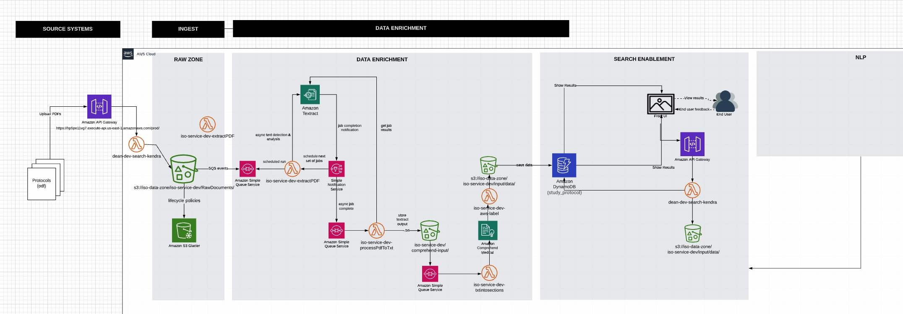

# UCP Protocol Extraction Architecture

UCP Protocol Extraction Architecture will help user to quickly identify the required information, ...

## Front UI
https://ucp.d3g78hu07xspg4.amplifyapp.com
username: testMe
pwd: !QAZ2wsx#EDC4rfv
## code structure
- layers
   > - 
- AwsUtils.py
- DownloadUtils.py
- preProcessData.py - Trigger by S3 event to handler new file on S3 to generate metadata, download content, process xml
- DownloadUtils.py  - Utils for download
- extractPDF.py     -  Trigger a async job to extract PDF
- ExtractUtils.py
- ExcelUtils.py     - Utils for Excel handler
- jsontocomprehend.py   - Send json to AWS comprehend service
- LoadJsonIntoES.py
- processPdfToTxt.py    - Get results from the async job returned by AWS Textract job
- protocolsDownload.py
- saveData.py
- serverless.yml       - A deploy template for the serverless framewrok
- summaryJobs.py
- syncSources.py
- txttocomprehend.py    - Put the txt into AWS comprehend medical and get results
- upload.py
- processXMLToJson.py   - This lambda function converts XML files to JSON files
- processXMLToJsonBatch.py   - This lambda function converts XML files to JSON files batch
- processXMLToJsonBatchRollup.py   - This lambda function converts XML files to JSON files batch
- SaveDataUtils.py     - Utils to save data to dynamodb and elasticsearch
- topicModelling.py    - Process AWS TopicModelling for txt
- criteriaSummary.py   - Process certeria frequency
- criteria.py

## code pipeline
- Provide a upload API by upload.py in Amazon API Gateway(https://hp5pe11vg7.execute-api.us-east-1.amazonaws.com/prod/)
- Put a PDF through upload API, and save into S3://iso-service-dev/RawDocuments/
- Trigger a S3 event: and call Lambda Function(extractPDF.py)
- Lambda call AWS Textract async job, and bind the SNS event(AmazonTextractExtractPDF)
- SNS will trigger a SQS(extractPDFQueue) after the aysnc Textract job is done
- SNS trigger lambda(processPdfToTxt.py) get AWS Textract job result by job id save results into txt on s3 bucket S3://iso-service-dev/comprehend-input/
- After txt file saved into S3, trigger another S3 event and call Lambda(txtintosections.py) to send to AWS Comprehend Medical and save result in S3 bucket S3://iso-service-dev/comprehend-output/
- Use lambda aws-label.py to process the AWS Comprehend Medical results, and save process results into s3://iso-data-zone/iso-service-dev/input/data/
- FrontEnd use the Amazon API Gateway(https://hp5pe11vg7.execute-api.us-east-1.amazonaws.com/prod/) to call lambda(upload.py) to get the results in s3://iso-data-zone/iso-service-dev/input/data/, and show it in the UI

## Design Flow

-

links: https://lucid.app/lucidchart/invitations/accept/inv_1603edb2-9ec4-40a2-a48d-77653ec7045f
## Deployment
- set the AWS token
>  > ``aws sts get-session-token --serial-number arn:aws:iam::608494368293:mfa/devuser --token-code 251689``
- run deploy command
>  > ```sls deploy -v```

I wanted to start involving you in building out 3 serverless applications test
  we are planning to deploy on the platform. (We can start building on our internal AWS environment.)

1 - DQS ingest enhancement
2 - Text extraction service (similar to LENS work but completely automated and production ready)
3 - Text enrichment service (similar to LENS comprehend pipeline but completely automated and production ready)

- Create a bucket Everest-db-new
- Create folder inside the bucket. Site-Allocation-input
- Lambda function should be triggered when new files are dropped in this folder
- Use SQS for Async data transfer
- Send data to Textract
- Save the output in the same bucket. Automatically create a new folder “Site-Allocation-output” for saving the output data in both json and text.
- Prepare a cloud formation script to deploy this service in a different account for later.

## reference:
    1. https://github.com/aws-samples/amazon-textract-serverless-large-scale-document-processing

## Run unit tests:
    python3 -m unittest discover tests


## 
